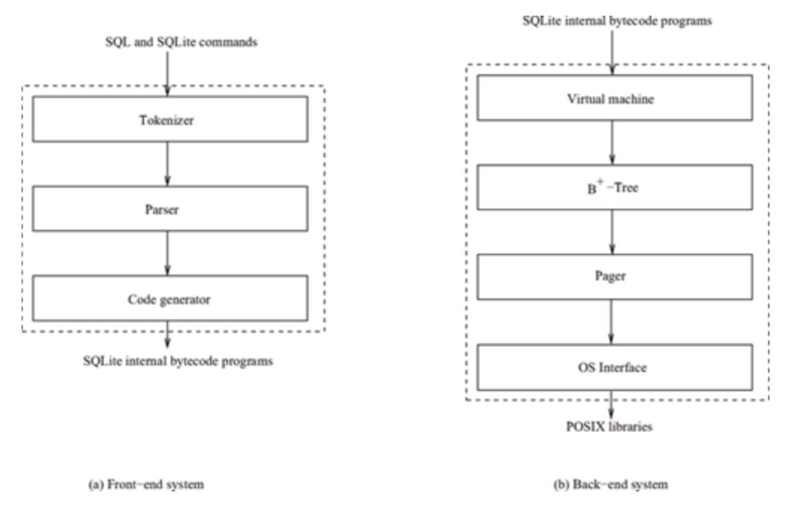

### 1.2 SQLite 的架构

SQLite 包含七个主要子系统组件（也叫做模块），它们被区分为两个部分：前端解析系统和后端引擎。如图 1-1 所示，下面两个图展示了这些系统组件和它们之间的联系。

*图 1-1 SQlite 的组件*

前端预处理应用程序输入的 SQL 语句和 SQLite 命令。它分析、优化这些语句（和命令），然后生成后端可以解析的 SQLite 内部字节码程序。前端部分由下面三个模块组成：

+ *词法分析器（The tokenizer）*
	
	分词器把输入的语句分割成记号。
	
+ *语法分析器（The parser）*
	
	词法分析器通过分词法分析器产生的记号，来确定语句的结构，并生成解析树。语法分析器同时也包括重构解析树的优化器，用来找到一个等效的可以产生高效率字节码程序的解析树。
	
+ *代码生成器（The code generator）*
	
	代码生成器遍历解析树，生成一个等效的字节码程序。
	
前端实现了 `sqlite3_prepare` 函数。

后端是一个解释字节码程序的引擎。后端做实际的数据库进程工作。后端部分分为四个模块：

+ *虚拟机 （VM, The Virtual Machine）*
	
	虚拟机是内部字节码语言的解释程序。它运行字节码程序来执行 SQL 语句的操作。它是数据库数据的最终操控者。当表或索引是一系列元组或记录的时候，它吧数据库看作表和索引的集合。
	
+ *B/B+-tree*
	
	B/B+ 树把每一个元组组织到一个有序的数据结构树里面；表盒索引分别在 B+ 树和 B 树。（我讲在[第五章《表和索引的管理》](./5.0.TableAndIndexManagement.md)中讨论这些数据结构。）此模块帮助 VM 在树中搜索、插入和删除元组。它也帮助 VM 创建新的树，删除旧的树。
	
+ *The pager*
	
	Pager 模块在本机顶部实现了面向页面的数据库文件抽象。它管理 B/B+ 树使用的内存中的数据库也缓存，另外，它也管理文件锁定和日志记录，以便实现事务的 ACID 特性。
		
+ *操作系统接口*
	
	操作系统接口模块为不同的操作系统提供了统一的接口。
	
后端实现了 `sqlite3_bind_*,sqlite3_step,sqlite3_column_*,sqlite3_reset` 和 `sqlite3_finalize` API 函数。

**主意**

*由于空间有限，在这里我只讨论 SQLite 引擎，不讨论解析系统。本书中的例子都是在 Linux 系统上实现的，但 SQlite 是可以移植到很多其他操作系统上的，不管你使用什么平台，它们运行起来都应该是相似的。*
	