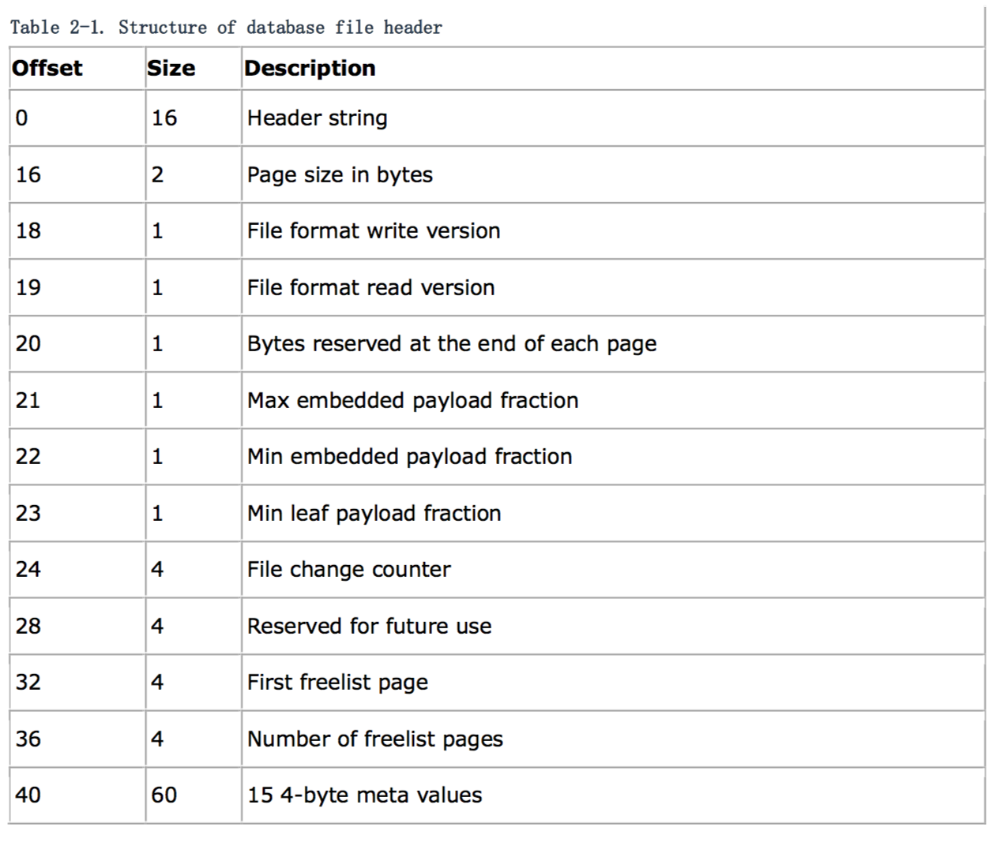
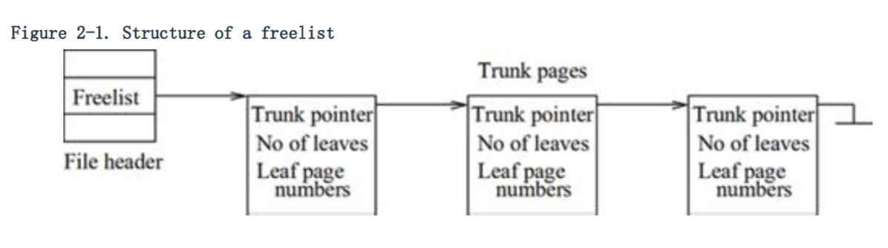

### 数据库文件结构

除了存储数据库（in-memory databases），SQLite 把所有的（主要或临时）数据库都存储在单个数据库文件中。

为了便于管理和读/写数据库，SQLite 把每一个数据库（包括存储数据库）都划分为一个叫做数据库页或简称为页的固定大小的区域。页的大小是在 512 至 32,768 之间（包括它们）的 2 的指数；默认的值是 1024。（The upper bound is a limit imposed by the necessity of storing page size in 2-byte signed integer variables in various places in code and external storage.）数据库是一个页里面的（可伸缩性）的数组。每个数组的索引是被叫做页码（page number）。页码从 1 开始，可连续地增加到 2,147,483,647（2^31 - 1）。（这个上界可能会根据本地文件系统最大文件大小做进一步限制。）0 这个页码是空页（NULL page）或者不是一页 —— 这个页在物理上是不存在的。第 1 页和后面的页，是按顺序依次存储在数据库文件中的。

**注意**

一旦数据库文件建立后，SQLite 使用编译的时间来初始化页的大小，但在数据库中创建第一张表之前，这个大小可以被程序命令改变。SQLite 把这个大小作为元数据的一部分保存。它将使用页的大小代替默认值。（就像之前提到那样，程序命令被用来改变数据库的行为。可以在 SQLite 的主页查看更多详情。）

页有四种类型：left，internal，overflow 和 free。Free pages 是休眠的页（当前不被使用）；其他的事动态的页。B+-tree internal pages contain navigational information for searches (B-tree internal pages have search information and data). Leaf pages store actual data (e.g., table rows) in B+-trees. If a row's data is too large to fit in a single page, part of the data is stored in the tree page, and the remaining part in overflow pages.

SQLite 可以使用任何数据库作为页的类型，除了第一页，第一页是 B+-tree 的内部页。这一页包含 100 个字节。The page also contains a 100 byte file header record that is stored starting at file offset 0. The header information characterizes the structure of the database file. SQLite initializes the header when it creates the file. The format of the file header is given in the following table. The first two columns in Table 2-1 are in bytes.

下面是每个头部的描述：

+ *Header string*
	
	This is the 16 byte string: "SQLite format 3."

+ *Page size*
	
	This is the size of each page in this database.

+ *File format*
	The two bytes at offsets 18 and 19 are used to indicate the file format version. They both have to be 1 in the current version of SQLite, or an error is returned. If future file format changes occur, these numbers will increase to indicate the new file format version number.
	
+ *Reserved space*
	
	SQLite may reserve a small fixed amount of space (<= 255 bytes) at the end of each page for its own purpose, and this value is stored at offset 20; the default value is 0. It is nonzero when a database uses SQLite's built-in encryption technology. The first part of a page (page size minus reserved size) is the usable space where database content proper is stored.

+ *Embedded payload*
	
	The max embedded payload fraction value (at offset 21) is the amount of the total usable space in a page that can be consumed by a single entry (called a cell or record) of a standard B/B+-tree internal node. A value of 255 means 100 percent. The default max embedded payload fraction value is 64 (i.e., 25 percent): the value is to limit the maximum cell size so that at least 4 cells fit on one node. If the payload for a cell is larger than the max value, then extra payload is spilled into overflow pages. Once SQLite allocates an overflow page, it moves as many bytes as possible into the overflow page without letting the cell size to drop below the min embedded payload fraction value (at offset 22). The default value is 32, i.e., 12.5 percent.
	
	The min leaf payload fraction value (at offset 23) is like the min embedded payload fraction, except that it is for B+-tree leaf pages. The default value is 32, i.e., 12.5 percent. The max payload fraction value for a leaf node is always 100 percent (or 255), and is not specified in the header. (There are no special-purpose leaf nodes in B-trees.)

+ *File change counter*
	
	The file change counter (at offset 24) is used by transactions. That value is incremented by every transaction. This value is intended to indicate when the database has changed so that the pager can avoid having to flush its cache, though that feature has not been implemented as of this writing. The pager is responsible for incrementing this value.
	
+ *Freelist*
The freelist of unused pages originates in the file header at offset 32. The total number of free pages is stored at offset 36. The freelist is organized in a rooted trunk (see Figure 2-1). Freelist pages come in two subtypes: trunk pages and leaf pages. The file header points to the first one on the linked list of trunk pages. Each trunk page points to multiple leaf pages. (A leaf page content is unspecified.)

A trunk page is formatted like the following, starting at the base of the page:

+ A 4-byte page number of the next trunk page
+ A 4-byte integer value to indicate the number of leaf pointers stored on this page
+ Zero or more 4-byte page numbers for leaf pages
	
	When a page becomes inactive, SQLite adds it to the freelist, and does not release it to the native filesystem. When you add new information to the database, SQLite takes out free pages off the freelist to store the information. If the freelist is empty, SQLite acquires new pages from the native filesystem, and appends them to the database file.
	
**注意**

You can purge the freelist by executing the vacuum command on the database. The command makes a copy of the database into a temporary file (the copy is made using INSERT INTO ... SELECT * FROM... commands). Then, it overwrites the original database with the temporary copy, under the protection of a transaction.

+ *Meta variables*

	At offset 40, there are fifteen 4-byte integer values that are reserved for the B+-tree and the VM (virtual machine) modules. They represent values of many meta variables, including the database schema cookie number at offset 40; this value is incremented at each schema change. Other meta variables include the file formatting information of the schema layer at offset 44, the page cache size at 48, the autovacuum flag at 52, the text encoding (1:UTF-8, 3:UTF-16 LE, 4:UTF-16 BE) at 56, and the user version number at 60. You can find more information about these variables in the SQLite source files, notably btree.c.
		
**注意**

*The database file format for SQLite is backward compatible back to version 3.0.0. This means that any version of SQLite can read and write a database file that was originally created by version 3.0.0. This is mostly true in the other direction—version 3.0.0 of SQLite can usually read and write any SQLite database created by later versions of the library. However, there are some new features introduced by later versions of SQLite that version 3.0.0 does not understand, and if the database contains these optional new features, older versions of the library will not be able to read and understand it.*

The file header is followed by a B+-tree internal node on Page 1. The node is the root of the master catalog table, named sqlite_master or sqlite_temp_master for a regular (main or attached) or temp database, respectively.

**注意**

All multibyte integer values are stored in the big-endian (most significant byte first) order. This lets you safely move your database files from one platform to another.

