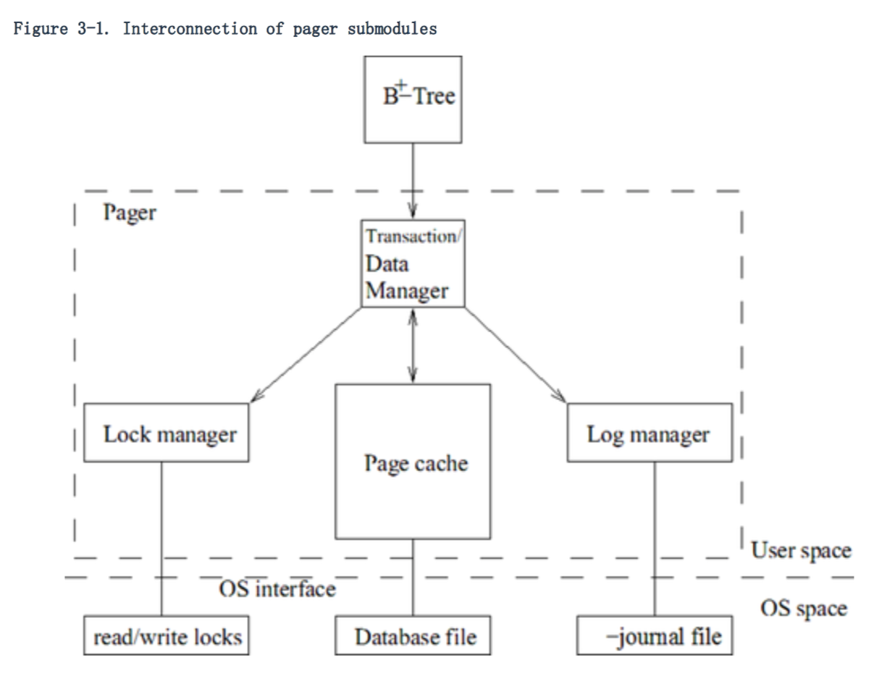

### 3.1 Pager 的主要任务

对于每个数据库文件，作为缓存管理器，在文件之间移动 page 和 cache 是 pager 的基本函数。Page 的移动显然是移动到 B+ 树和更高层的模块。Pager 相当于本地文件系统和其他模块之间中介。它的主要目的是使数据库页（database pages）在主存储器中可寻址，这样的话，其他模块就可以直接访问 page 的内容。

除了缓存管理器的工作，pager 也实现了很多其他典型的 DBMS 函数。 它提供一个事务处理系统的核心服务：事务管理、数据管理、日志管理和锁管理。作为事务管理器，它通过负责并发控制和恢复实现了事务的 ACID 特性。它负责事务的原子性提交（atomic commit）和回滚（rollback）。作为一个数据管理器，它在数据库文件中以缓存和文件空间管理的方式协调 page 的读写。作为日志管理器，它决定日志记录的写入。作为一个锁管理器，在连接数据库 page 之前，它确保数据库文件上的事务有合适的锁。简而言之，pager 模块实现了存储的持久性和事务的原子性。Pager 所有子模块之间的相互联系如图 3-1 所示。

**注意**

由于锁机制和日志管理机制，所有 pager 之上的模块都是完全隔绝的。实际上，它们不会知道锁和日志的活动。B+ 树模块根据事务看到所有的事情，它不需要关心事务的 ACID 特性是如何实现的。Pager 模块把数据库文件的事务活动分为锁定（locking）、日志记录（logging）、读（reading）和写（writing）。B+ 树通过页码（page number）从 pager 中获取一页（page）。反过来，pager 返回一个已经加载到 page cache 中的 page data 的指针。再修改一个 page 之前，B+ 模块会通知 pager，这样 pager 就可以保存足够的数据到日志文件中，以便将来恢复时使用，同时也可以获得数据库文件的锁。B+ 树使用完一个 page 的时候，最终会通知 pager；如果 page 被修改了，pager 就把 page 写会文件。
