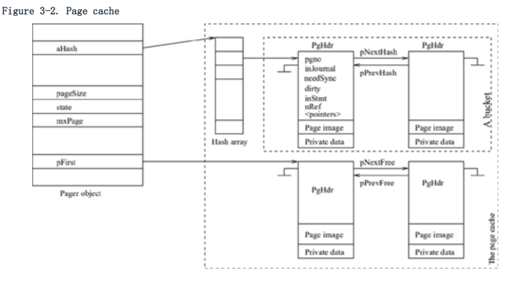

### 3.3 缓存管理

SQLite 对每个打开数据库文件维护一个单独的 page cache。如果一个线程打开同一个文件两次或多次，pager 只在第一次打开的时候为这个文件创建并初始化一个单独的 page cache。如果两个或多个线程打开同一个文件，就会为这个文件创建多个独立的 cache。存储数据库（In-memory database）不涉及任何外部存储设备。不过它们仍然被当作普通本地文件来处理，它们也被完全存储在 cache 中。这样 B/B+ 树模块就使用相同的借口来访问这两种不同类型的数据库。

**注意**

页缓存（page cache）驻留在应用程序的内存空间。相同的 page 可能被本机操作系统缓存。当一个应用程序读取任何文件中的一块数据，操作系统首先复制一个数据副本，然后把副本拷贝到应用程序。（the operating system normally makes its own copy of the data first, and then a copy in the application.）我们没有兴趣去知道操作系统是如何管理它自己的缓存的。SQLite 的 page cache 的组织和管理独立于操作系统的缓存管理。

对系统性能来说，管理 page cache 是非常重要的。接下来我们将讨论 pager 如何管理和维护 page cache，以及缓存客户端（page client）如何读取和修改缓存元素。

一般来说，为了快速搜索缓存，当前在缓存中的项目是被很好的组织在一起的。SQLite 使用一张哈希表（hash table）来组织 cache page，同时使用 page-slots 来管理表中的 page。Cache 是完全关联的，也就是说，任何 slot 都可以存储任何 page。哈希表最初是空的。随着 page 需求的增加，pager 创建新的 slot，并把它们插入到哈希表中。一个 cache 具有的 slot 有一个最大的数字限制。（只要本机操作系统允许应用程序空间的增长，in-memory database 就没有最大限制。）

 图 3-2 是一个典型的 cache 结构。哈希表中的每一个 cache 都相当于 PgHdr 类型的头对象。Page image 存储在 PgHdr 对象后面。Image 后面是一块 private data，在这里用于 B/B+ 树保存特定的页面控制信息。（In-memory databases 没有日志文件，所以它们的恢复信息保存在 in-memory 对象中。这些对象的指针保存在 private 部分：这些指针仅供 pager 使用。）附加的没有 page （additional nonpage）的空间，是当 pager 将 page 存入缓存时的 0 页。缓存里面的所有页都可以通过 Pager 对象中名为 aHash 的哈希数组来访问；当 SQLite 编译完成之后，数组的大小就固定了。每个数组元素都指向 page 中的一个 bucket。page 中的每个 bucket 都被组织在一个无序的双重链接列表中。
 
 PgHdr 只在 pager 模块中可见，在 B+-tree 和更高层的模块中是不可见的。头部有很多控制变量。pgno 变量定义了页码（page number）。如果 page 被写入到了恢复日志（rollback journal）中，那么 injournal 变量就为 true。当把数据写回数据库之前，如果日志需要刷新，那么 needSync 变量就为 true。文件上的刷新改变磁盘表面文件部分。（A flush on a file transfers modified parts of the file to the disk surface.）当文件被修改且新的值还没有写回数据库文件的时候，dirty 变量为 true。如果 page 在当前声明的日志中，那么 inStmt 为 true。nRef 变量是当前 page 中的引用计数。如果 nRef 的值大于 0，那么 page 就是可以使用的，我们把 page 的称为 pinned down；在其他情况下，page 是 unpinned 和 free 的。在 PgHdr 对象中，还有很多指针变量（在图中没有全部列出来）。pNextHash 和 pPrevHash 指针用于把哈希桶（hash bucket）中的 page 链接在一起。pNextStmt 和 pPrevStmt 指针把声明日志中的 page 链接在一起。（我将稍候讲到声明日志。）pNextFree 和 pPrevFree 指针把所有 free page 链接在一起。Free page 不会从哈希桶中取出，即使上面的示意图看起来像是这样。缓存中的所有 page（不管是不是 free）都被 pNextAll 指针链接到一起。pDirty 指针用于把所有的 dirty page 链接在一起。注意 free page 也可能变成 dirty page。
 
 通过搜索关键词—— page number 来引用 cache。B+-tree 模块通过对 page number 调用 page API 里面的 sqlite3pager_get 函数来读取一个 page。为了得到一个 page P，这个函数会执行下面几个步骤：
 
 1. 搜索缓存空间。
 	
 	a. 对 P 使用一个哈希函数，然后得到索引。（SQLite 使用一个非常简单的哈希函数来查找索引：page number 对aHash数组的大小取模。）
 	b. 对 aHash数组使用索引，然后得到 hash bucket。
 	c. 通过追踪 pNextHash 的指针，搜索 bucket。如果 P 被找到了，那我们就称缓存命中。 It pins down (i.e., increments the nRef value by 1) the page ，并且返回 page 的地址。
 2. 如果 P 没有被找到，则认为 cache miss。 The function looks for a free slot that can be used to load the desired page. (If the cache has not reached the maximum limit, it instead creates a new free slot.)
 3. If no free slot is available or can be created, it determines a slot from which the current page can be released to reuse the slot. This is called a victim slot.
 4. If the victim (or the free slot) is dirty, it writes the page to the database file. (Following write-ahead-log (WAL) protocol, it flushes the journal file.)
 5. It reads page P from the database file into the free slot, pins down the page (i.e., it sets the nRef value to 1), and returns the address of the page to the caller. If P is greater than the current max page in the file, it does not read the page; instead, it initializes the page to zeros. It also initializes the bottom private part to zeros whether it reads the page from the file.

SQLite 严格执行按需获取的政策来保证获取 page 的逻辑非常简单。

当客户端的 B+-tree 返回一个 page 地址时，pager 不需要知道客户端是怎么在 page 中工作的。SQLite 对每个 page 都使用了这一标准协议：客户端获取 page，使用 page，释放 page。获取 page 之后，客户端可直接修改 page 的内容，但在做任何修改的时候它都必须预先调用 sqlite3pager_write 这个 pager API 函数。On return from the call, the client can update the page in place。

The first time the write function is called on a page, the pager writes the original content of the page into the rollback journal file as part of a new log record, and sets the injournal and needSync flags on.Later, when the log record is flushed onto the disk surface, the pager clears the needSync flag.(SQLite follows WAL protocol: it does not write a modified page back into the database file until the corresponding needSync has been cleared.) Every time the write function is called on a page, the dirty flag is set;the flag is cleared only when the pager writes back the page content to the database file. Because the time when the client modifies a page is not known to the pager, updates on the page are not immediately propagated to the database file.  The pager follows a delayed write (write-back) page update policy. The updates are propagated to the database file only when the pager performs a cache flush or selectively recycles dirty pages.

Cache replacement refers to the activity that takes place when a cache becomes full, and old pages are removed from the cache to make room for new ones. As mentioned in the "Cache read" section, when a requested page is not in the cache and a free slot is not available in the cache, the pager victimizes a slot for replacement. You may recall that the page cache is fully associative, that is, any slot is good for the new page. The slot that is victimized is dictated by the cache replacement policy. SQLite follows a kind of least recently used (LRU) cache replacement policy.

SQLite organizes free pages in a logical queue. When a page is unpinned, the page appends the page at the tail end of the queue. The victim is chosen from the header end of the queue, but may not always be the head element on the queue as is done in the pure LRU. SQLite tries to find a slot on the queue starting at the head such that recycling that slot would not involve doing a flush of the journal file.(Following the WAL protocol, before writing a dirty page to the database file, the pager flushes the journal file. Flushing is a slow operation, and SQLite tries to postpone the operation as long as possible.) If such a victim is found, the foremost one on the queue is recycled.Otherwise, SQLite flushes the journal file first, and then recycles the head slot from the queue. If the victim page is dirty, the pager writes the page to the database file before recycling it.

**注意**

*Pinned pages are currently in active use and cannot be recycled. To avoid the scenario in which all pages in the cache are pinned down, SQLite needs a minimum number of slots in the cache so that it always has some cache slot(s) to recycle; the minimum value is 10 as of the SQLite 3.3.6 release.*

在这一章节中，我讲了 page 缓存管理（page cache management），下一章节是事务管理。

### 一些术语

+ statement journal  声明日志
+ hash bucket 哈希桶

### ISSUE 

+ page number modulo the size of the aHash array